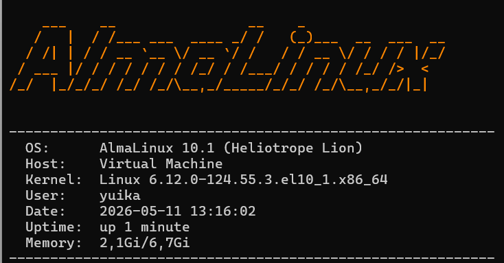
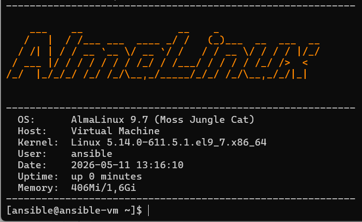
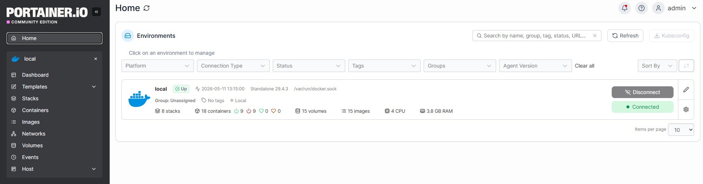
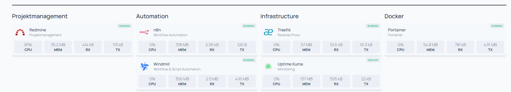
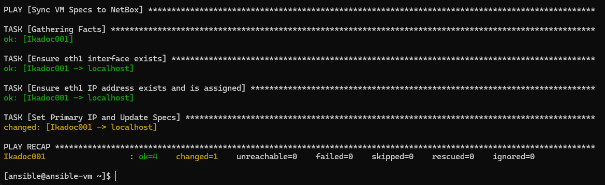

# HomeLab Infrastructure & Automation

Ein Projekt zur Implementierung einer privaten Cloud-Umgebung auf Basis von **AlmaLinux unter Hyper-V**, kombiniert mit Docker-Container-Orchestrierung und **Ansible-Automatisierung**.

## Überblick

Dieses Projekt demonstriert den Aufbau einer skalierbaren Infrastruktur, die Sichtbarkeit (NetBox), Management (Portainer) und Automatisierung (Ansible) vereint. Ein besonderes Highlight ist die Kopplung von Ansible mit NetBox als „Source of Truth“.

Die Umgebung besteht aus zwei Haupt-VMs (**Ikadoc001** und **Ikaan001**), die über ein duales Switch-System in Hyper-V angebunden sind, um eine stabile Kommunikation und Internetzugang zu gewährleisten, ohne dass bei jedem Deployment manuelle Code-Anpassungen nötig sind.





## Netzwerk-Konfiguration

Um eine produktionsnahe Umgebung zu simulieren, werden zwei virtuelle Switche genutzt:

* **Default Switch:** Ermöglicht den Internetzugang für Updates und externe Erreichbarkeit.
* **Internal Switch:** Verbindet Ikadoc001 und Ikaan001 in einem isolierten Netzwerk (192.168.10.x).
* **Statische IPs:** Alle Management-Schnittstellen nutzen feste IP-Adressen. Dies stellt sicher, dass Ansible-Playbooks und interne API-Kommunikation auch nach einem Neustart oder Re-Deployment sofort wieder funktionieren.

## Infrastruktur-Stack (Ikadoc001)

### 1. Basis-Infrastruktur

* **Hypervisor:** Hyper-V
* **Betriebssystem:** AlmaLinux 10.1
* **Container-Laufzeit:** Docker & Docker Compose


### 2. Services (Docker-Container)

Für eine benutzerfreundliche Umgebung wurden Dienste gewählt, die auch für Kollegen ohne tiefgehende Linux-Kenntnisse leicht bedienbar sind.

| Service | Rolle | Besonderheit / Grund der Wahl |
| --- | --- | --- |
| **Portainer** | Container-Management | **GUI statt CLI:** Ermöglicht es, Container per Klick zu stoppen, zu starten und Logs einzusehen, ohne die Konsole nutzen zu müssen. |
| **Traefik** | Reverse Proxy | Automatisches Routing über FQDNs und SSL-Terminierung. |
| **Homepage** | Dashboard | Zentraler Überblick über alle laufenden Ressourcen und Links. |
| **NetBox** | IPAM / DCIM | Die „Source of Truth“ für das gesamte Netzwerk und alle Server-Assets. |
| **Zabbix** | Monitoring | Echtzeit-Überwachung der Systemgesundheit. |
| **Redmine** | Projektmanagement | Dokumentation von Workflows und Wissensdatenbank. |
| **n8n / Windmill** | Automatisierung | Low-Code Plattformen für komplexe Workflow-Automatisierungen. |



## Automatisierung & Ansible

Das Herzstück der Wartung ist die Integration von **Ansible**. Der Ansible-Server liest die registrierten Hosts direkt aus NetBox aus.

### Automatische Spezifikations-Synchronisation

Anstatt Daten manuell einzupflegen, erfasst Ansible automatisch folgende Informationen von den VMs und schreibt sie in die NetBox-Datenbank zurück:

* **IP-Adressen** (feste Management-IPs)
* **Seriennummern** (Hyper-V UUIDs)
* **CPU-Kerne** (vCPUs)
* **Arbeitsspeicher** (Memory MB)
* **Festplattenkapazität** (Disk Total/Used GB)
* **Betriebssystem & Kernel** (OS Version, Kernel Release)

---

## Installation & Setup

### Portainer Installation

Um Portainer auf deinem Docker-Host (Ikadoc001) zu installieren, verwende die folgenden Befehle. Dies erstellt ein persistentes Volume und startet den Container mit Zugriff auf den Docker-Socket.

```bash
# Erstellen eines Volumes für die Portainer-Daten
docker volume create portainer_data

# Starten des Portainer-Containers
docker run -d -p 8000:8000 -p 9443:9443 --name portainer \
    --restart=always \
    -v /var/run/docker.sock:/var/run/docker.sock \
    -v portainer_data:/data \
    portainer/portainer-ce:latest

```

*Nach dem Start ist Portainer unter `https://<IP-Adresse>:9443` erreichbar.*

### Ausführen der Automatisierung

```bash
# Synchronisation der VM-Specs mit NetBox
ansible-playbook -i netbox_inventory.yml sync_to_netbox.yml -k -K

```


---