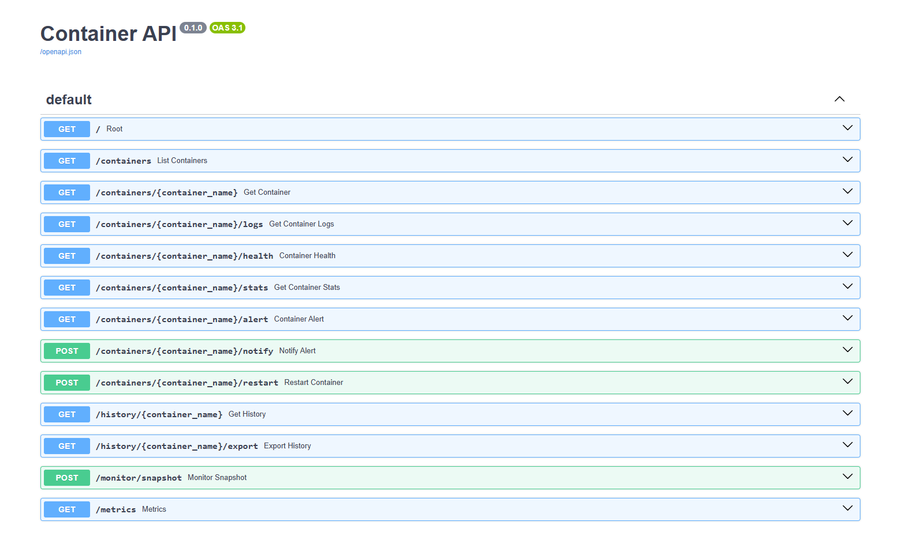
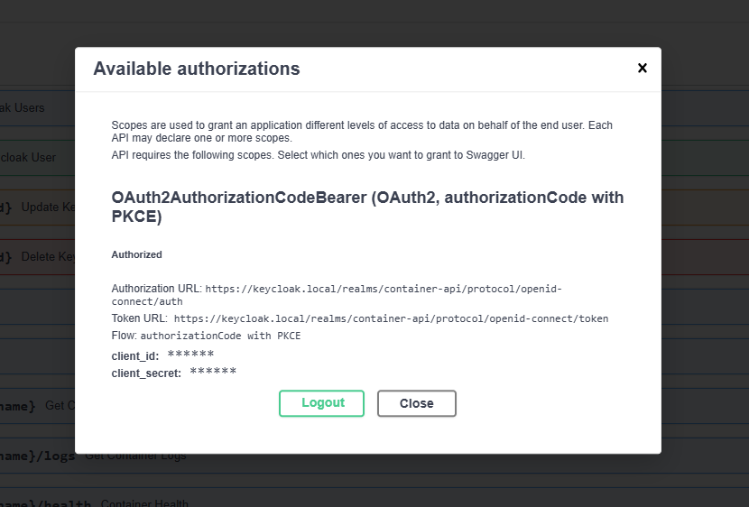
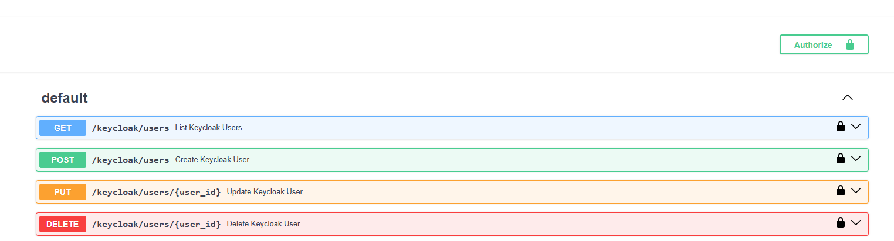
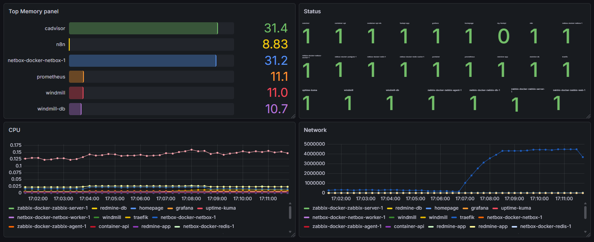
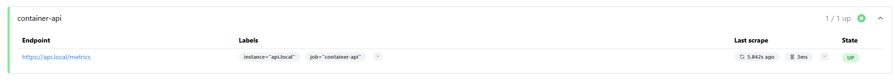
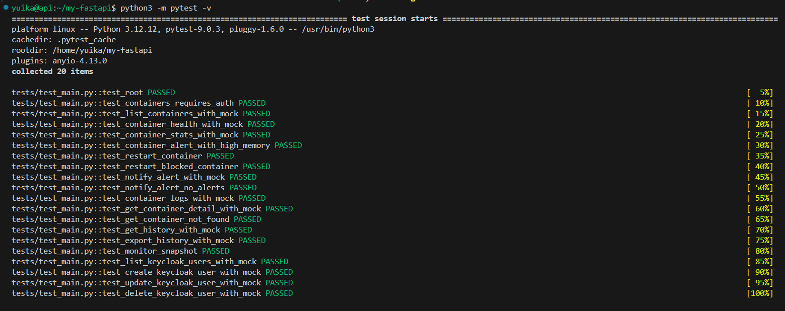

# HomeLab Infrastructure & Automation

Ein Projekt zur Implementierung einer privaten Cloud-Umgebung auf Basis von **AlmaLinux unter Hyper-V**, kombiniert mit Docker-Container-Orchestrierung und **Ansible-Automatisierung**.

## Überblick

Dieses Projekt demonstriert den Aufbau einer skalierbaren Infrastruktur, die Sichtbarkeit (NetBox), Management (Portainer) und Automatisierung (Ansible) vereint. Ein besonderes Highlight ist die Kopplung von Ansible mit NetBox als „Source of Truth“.

Die Umgebung besteht aus zwei Haupt-VMs (**Ikadoc001** und **Ikaan001**), die über ein duales Switch-System in Hyper-V angebunden sind, um eine stabile Kommunikation und Internetzugang zu gewährleisten, ohne dass bei jedem Deployment manuelle Code-Anpassungen nötig sind.


## Netzwerk-Konfiguration

Um eine produktionsnahe Umgebung zu simulieren, werden zwei virtuelle Switche genutzt:

* **Default Switch:** Ermöglicht den Internetzugang für Updates und externe Erreichbarkeit.
* **Internal Switch:** Verbindet Ikadoc001 und Ikaan001 in einem isolierten Netzwerk (192.168.10.x).
* **Statische IPs:** Alle Management-Schnittstellen nutzen feste IP-Adressen. Dies stellt sicher, dass Ansible-Playbooks und interne API-Kommunikation auch nach einem Neustart oder Re-Deployment sofort wieder funktionieren.

## Infrastruktur-Stack (Ikadoc001)

### 1. Basis-Infrastruktur

* **Hypervisor:** Hyper-V
* **Betriebssystem:** AlmaLinux 10.1
* **Container-Laufzeit:** Docker & Docker Compose


### 2. Services (Docker-Container)

Für eine benutzerfreundliche Umgebung wurden Dienste gewählt, die auch für Kollegen ohne tiefgehende Linux-Kenntnisse leicht bedienbar sind.

| Service | Rolle | Besonderheit / Grund der Wahl |
| --- | --- | --- |
| **Portainer** | Container-Management | **GUI statt CLI:** Ermöglicht es, Container per Klick zu stoppen, zu starten und Logs einzusehen, ohne die Konsole nutzen zu müssen. |
| **Traefik** | Reverse Proxy | Automatisches Routing über FQDNs und SSL-Terminierung. |
| **Homepage** | Dashboard | Zentraler Überblick über alle laufenden Ressourcen und Links. |
| **NetBox** | IPAM / DCIM | Die „Source of Truth“ für das gesamte Netzwerk und alle Server-Assets. |
| **Zabbix** | Monitoring | Echtzeit-Überwachung der Systemgesundheit. |
| **Redmine** | Projektmanagement | Dokumentation von Workflows und Wissensdatenbank. |
| **n8n / Windmill** | Automatisierung | Low-Code Plattformen für komplexe Workflow-Automatisierungen. |


## Automatisierung & Ansible

Das Herzstück der Wartung ist die Integration von **Ansible**. Der Ansible-Server liest die registrierten Hosts direkt aus NetBox aus.

### Automatische Spezifikations-Synchronisation

Anstatt Daten manuell einzupflegen, erfasst Ansible automatisch folgende Informationen von den VMs und schreibt sie in die NetBox-Datenbank zurück:

* **IP-Adressen** (feste Management-IPs)
* **Seriennummern** (Hyper-V UUIDs)
* **CPU-Kerne** (vCPUs)
* **Arbeitsspeicher** (Memory MB)
* **Festplattenkapazität** (Disk Total/Used GB)
* **Betriebssystem & Kernel** (OS Version, Kernel Release)

---

## Installation & Setup

### Portainer Installation

Um Portainer auf deinem Docker-Host (Ikadoc001) zu installieren, verwende die folgenden Befehle. Dies erstellt ein persistentes Volume und startet den Container mit Zugriff auf den Docker-Socket.

```bash
# Erstellen eines Volumes für die Portainer-Daten
docker volume create portainer_data

# Starten des Portainer-Containers
docker run -d -p 8000:8000 -p 9443:9443 --name portainer \
    --restart=always \
    -v /var/run/docker.sock:/var/run/docker.sock \
    -v portainer_data:/data \
    portainer/portainer-ce:latest

```

*Nach dem Start ist Portainer unter `https://<IP-Adresse>:9443` erreichbar.*

### Ausführen der Automatisierung

```bash
# Synchronisation der VM-Specs mit NetBox
ansible-playbook -i netbox_inventory.yml sync_to_netbox.yml -k -K

```


## Container API & Monitoring Platform (FastAPI)

Zusätzlich wurde eine eigene Container-Management- und Monitoring-Plattform auf Basis von **FastAPI** entwickelt. Ziel war es, eine zentrale API bereitzustellen, die Docker-Container überwacht, Metriken sammelt und Infrastrukturdaten visualisiert.

Die Anwendung läuft selbst als Docker-Container und kommuniziert direkt mit der Docker Engine über den Docker Socket.

### Funktionen der Container API

Die FastAPI-Anwendung stellt verschiedene REST-Endpunkte bereit, um Containerinformationen zentral abzurufen und automatisierte Infrastrukturprozesse umzusetzen.

### Verfügbare API-Endpunkte

| Endpoint | Funktion |
| --- | --- |
| `/containers` | Liste aller Container |
| `/containers/{name}` | Detailinformationen eines Containers |
| `/containers/{name}/logs` | Abruf der Container-Logs |
| `/containers/{name}/stats` | CPU- und RAM-Auslastung |
| `/containers/{name}/health` | Status- und Health-Informationen |
| `/containers/{name}/restart` | Neustart eines Containers |
| `/metrics` | Prometheus-kompatible Metriken |
| `/history/{name}` | Historische Monitoring-Daten aus PostgreSQL |



### Monitoring & Observability

Ein Hintergrund-Worker überwacht automatisch alle laufenden Container in regelmäßigen Intervallen. Dabei werden unter anderem folgende Informationen gesammelt:

* Container-Status
* RAM-Auslastung
* CPU-Auslastung
* Netzwerk-Traffic
* Restart-Zähler

Die gesammelten Daten werden automatisch in PostgreSQL gespeichert und anschließend über Grafana visualisiert.

### Prometheus & Grafana Integration

Die API exportiert zusätzlich eigene Prometheus-Metriken über den Endpoint `/metrics`.

Dadurch kann Prometheus die Containerdaten automatisch per Scraping erfassen und in Grafana als Dashboard darstellen.

Verwendete Technologien:

* **FastAPI** – REST API & Monitoring-Service
* **Prometheus** – Metrics Collection
* **Grafana** – Dashboard & Visualisierung
* **PostgreSQL** – Speicherung historischer Monitoring-Daten
* **cAdvisor** – Container-Metriken
* **Traefik** – HTTPS Reverse Proxy
* **Docker SDK for Python** – Kommunikation mit der Docker Engine

### Sicherheitsfunktionen

Die API wurde zusätzlich abgesichert durch:

* API-Key Authentifizierung
* HTTPS/TLS über Traefik
* Reverse Proxy Routing über eigene lokale Domains (`api.local`, `grafana.local`, `prometheus.local`)

## Keycloak Integration & Identity Management

Zusätzlich wurde die Plattform um eine zentrale Benutzer- und Rechteverwaltung mit **Keycloak** erweitert. Ziel war es, eine produktionsnahe Authentifizierungs- und Autorisierungslösung für die FastAPI bereitzustellen.

Die FastAPI wurde dabei vollständig mit Keycloak integriert und verwendet JWT-basierte Authentifizierung über OAuth2/OpenID Connect.

### OAuth2 & JWT Authentication

Benutzer melden sich zunächst über Keycloak an und erhalten anschließend ein JWT-Token. Dieses Token wird bei jeder API-Anfrage automatisch an die FastAPI übertragen und dort überprüft.

Dabei werden unter anderem folgende Sicherheitsmechanismen verwendet:

* JWT-Validierung
* HTTPS/TLS über Traefik
* OAuth2 Login über Swagger UI
* Role Based Access Control (RBAC)
* Realm-basierte Zugriffskontrolle

Die FastAPI akzeptiert ausschließlich Tokens aus dem konfigurierten Keycloak-Realm. Dadurch wird verhindert, dass Benutzer aus anderen Realms auf die API zugreifen können.

### Benutzerverwaltung über FastAPI

Über die FastAPI wurden zusätzlich eigene Verwaltungs-Endpunkte implementiert, welche direkt mit der Keycloak Admin API kommunizieren.

Dadurch können Benutzerinformationen zentral über die API verwaltet werden.

### Implementierte CRUD-Funktionen

| Endpoint                        | Funktion               |
| ------------------------------- | ---------------------- |
| `/keycloak/users`               | Benutzerliste abrufen  |
| `/keycloak/users` (POST)        | Benutzer erstellen     |
| `/keycloak/users/{id}` (PUT)    | Benutzer aktualisieren |
| `/keycloak/users/{id}` (DELETE) | Benutzer löschen       |

Die Berechtigungen werden dabei vollständig über Keycloak-Rollen gesteuert.

Beispielsweise dürfen nur Benutzer mit der Rolle `container:admin` administrative Benutzeraktionen ausführen.

### Swagger OAuth2 Login

Für Tests und API-Dokumentation wurde zusätzlich Swagger UI mit OAuth2-Authentifizierung integriert.

Dadurch können sich Benutzer direkt über die Weboberfläche bei Keycloak anmelden und anschließend geschützte API-Endpunkte testen.

Dies simuliert moderne Backend- und Plattform-Architekturen, wie sie häufig in DevOps-, Cloud- und SaaS-Umgebungen verwendet werden.






### Beispielhafte Monitoring-Metriken

Über Prometheus und Grafana werden unter anderem folgende Werte visualisiert:

* Container CPU-Auslastung
* RAM-Verbrauch
* Netzwerk-Durchsatz
* Container-Status (running/stopped)
* Historische Ressourcen-Auslastung

Dadurch entstand eine produktionsnahe Monitoring-Umgebung ähnlich moderner DevOps- und Plattform-Infrastrukturen.




## Tests & Qualitätssicherung

Für die API wurden automatisierte Tests mit `pytest` implementiert, um wichtige Funktionen der Anwendung zuverlässig zu prüfen.

Dabei werden externe Dienste wie Docker, Slack, Datenbank oder Keycloak nicht direkt verwendet, sondern durch Mock-Objekte simuliert. Dadurch können die Tests schnell, stabil und unabhängig von der Umgebung ausgeführt werden.

### Getestete Funktionen

- API Root Endpoint
- Authentifizierung und Rollenprüfung
- Container-Liste
- Container-Details
- Container-Logs
- Health-Status von Containern
- CPU- und Memory-Statistiken
- Alert-Erkennung bei hoher Speichernutzung
- Restart von Containern
- Schutz kritischer Container vor Neustarts
- Slack-Benachrichtigungen
- CSV-Export der Monitoring-Historie
- Monitoring Snapshot Funktion
- Keycloak User Management
  - Benutzer auflisten
  - Benutzer erstellen
  - Benutzer aktualisieren
  - Benutzer löschen



### Mocking externer Dienste

Für die Tests wurden verschiedene externe Komponenten simuliert:

- Docker SDK
- Slack Webhooks
- Keycloak API
- Datenbankzugriffe

Dadurch kann die API getestet werden, ohne echte Container oder externe Systeme starten zu müssen.

### Asynchrone Verarbeitung

Die Slack-Benachrichtigungen wurden zusätzlich auf asynchrone HTTP-Kommunikation mit `httpx.AsyncClient` umgestellt.

Dadurch blockiert die API während externer HTTP-Anfragen nicht den gesamten Request-Thread und kann mehrere Anfragen effizienter verarbeiten.

Auch die asynchronen Funktionen wurden mit `pytest` getestet.

### Beispiel Test-Ausführung

```bash
pytest -v
```
---